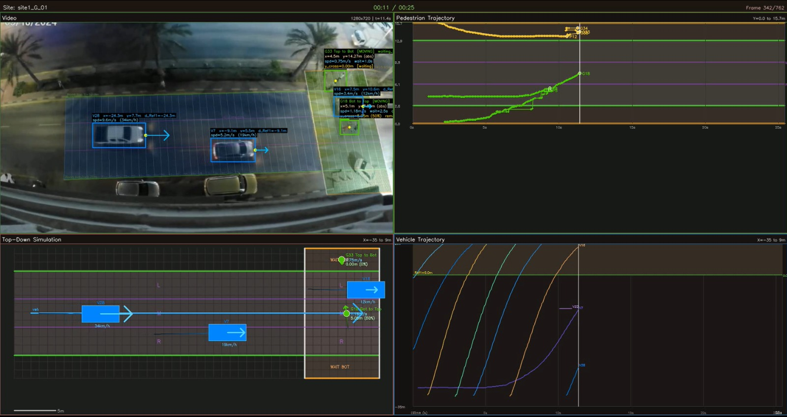
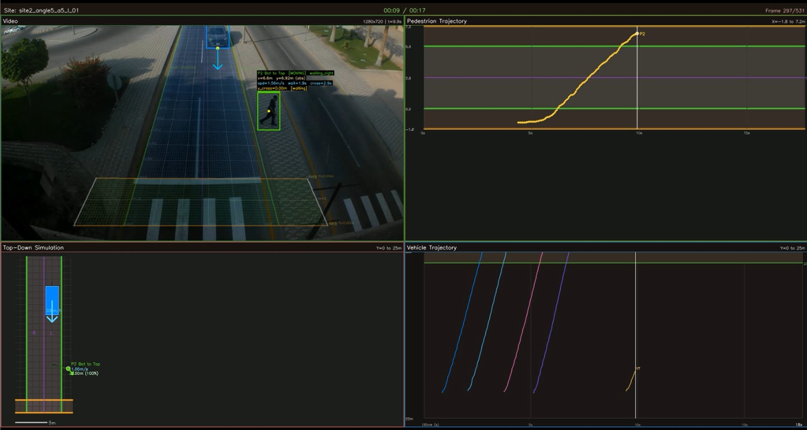
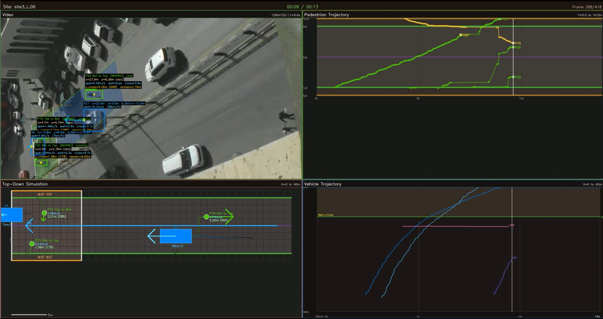

# 🚦 Vision-Based Modeling of Pedestrian-Vehicle Interactions & Near-Miss Analysis

🏆 **1st Place Award Winner - Best Senior Design Project (SDP)** | *Imam Abdulrahman Bin Faisal University*

## 📋 Project Overview
This repository contains the finalized code and analysis pipeline for an automated, proactive traffic safety analysis system targeting unsignalized mid-block crosswalks. By bridging traditional traffic engineering with advanced computer vision, this project replaces subjective manual methodologies with robust, AI-driven trajectory extraction.

## ✨ Key Features
- **Automated Trajectory Extraction:** Utilizes state-of-the-art **YOLOv11 / YOLOv8** for object detection and **BoT-SORT** for robust multi-object tracking.
- **Surrogate Safety Measures (SSMs):** Computes complex safety metrics including Post-Encroachment Time (PET), Gap Acceptance, and conflict severity.
- **Browser-Based Simulation:** An interactive web simulation calibrated with real-world extracted trajectories to test and validate targeted safety countermeasures.

## 📊 Data Insights & Final Results
The final analysis was conducted across 3 different urban sites in the Eastern Province, yielding a massive dataset of real-world interactions:
- Successfully extracted and analyzed **508 complete crossing events** across multiple lanes.
- Identified that **55.1% of interactions** posed high collision risks (PET < 2s).
- Revealed that **71.5% of pedestrian crossings were forced**, highlighting critical infrastructure hazards and the need for immediate smart-city interventions.

## 📸 Visualizing the Pipeline

  

  

  

